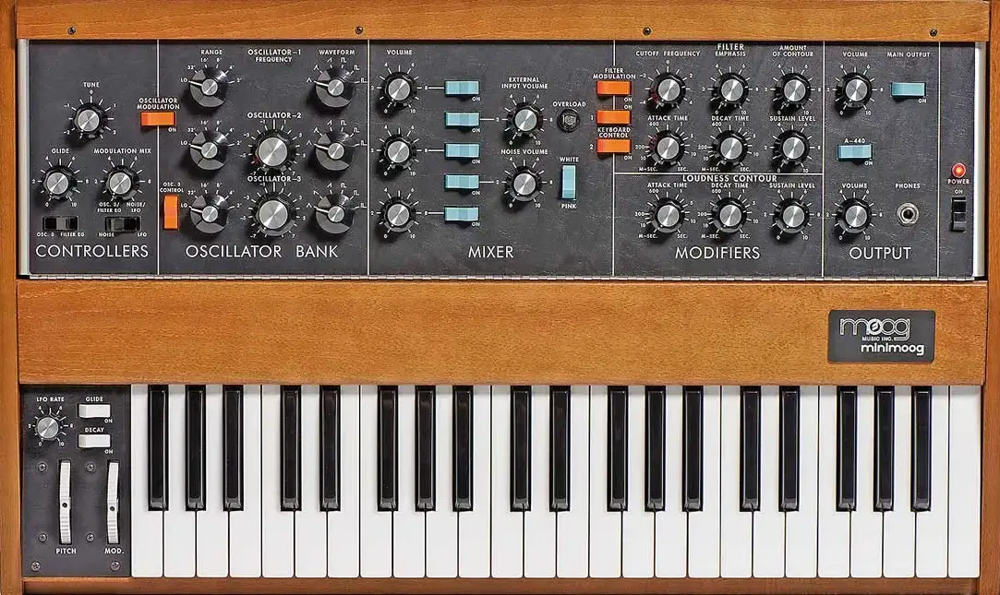
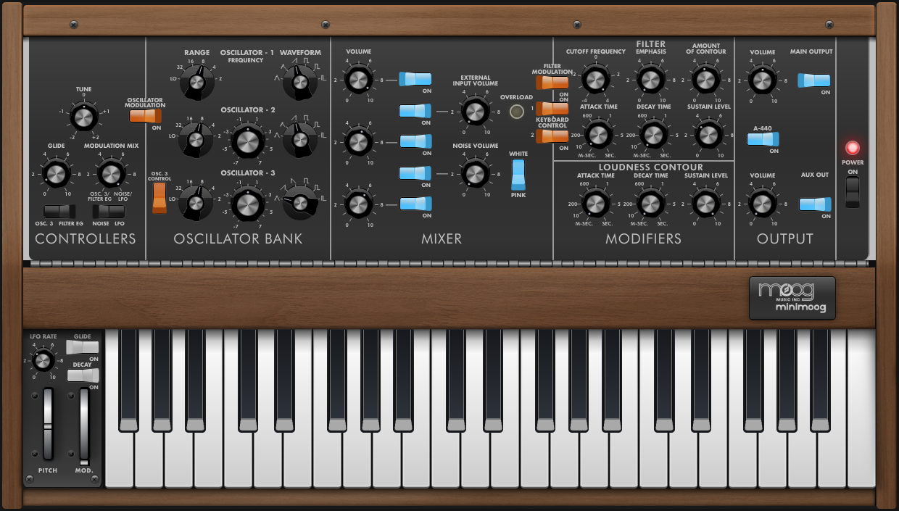

# Minimoog Model D Emulator

A web-based emulation of the classic Minimoog Model D analog synthesizer, leveraging the Web Audio API for authentic sound synthesis and performance.

[](https://nodejs.org/)
[](https://reactjs.org/)
[](https://www.typescriptlang.org/)
[](https://vitest.dev/)
[](LICENSE)

---

## Table of Contents

- [Demo](#demo)
- [Overview](#overview)
- [Features](#features)
- [Quick Start](#quick-start)
- [Development](#development)
- [Project Structure](#project-structure)
- [Architecture](#architecture)
- [Testing](#testing)
- [URL State Persistence](#url-state-persistence)
- [Troubleshooting](#troubleshooting)
- [Contributing](#contributing)
- [Third-Party Credits](#third-party-credits)
- [Resources](#resources)
- [References](#references)
- [License](#license)

---

## Demo

Experience the Minimoog Model D emulator in your browser:

1. **Live Demo**: [https://minimoog.vercel.app](https://minimoog.vercel.app/)
2. **Local Development**: Follow the [Quick Start](#quick-start) guide below

---

## Overview

This project recreates the iconic Minimoog Model D synthesizer in the browser using modern web technologies. It provides an authentic recreation of the original instrument's sound and interface, making the legendary synthesizer accessible to anyone with a web browser.

- **Authentic Sound**: Faithful recreation of the synthesizer's oscillator characteristics and filter behavior
- **Real-time Performance**: Low-latency audio processing for live performance
- **Responsive Design**: Works seamlessly on desktop and mobile devices
- **Modern Web Standards**: Built with React 19, TypeScript, and Web Audio API
- **Open Source**: Complete source code available for learning and modification

<p align="center">
  <br/>
  <em>Original Minimoog Model D (hardware)</em>
</p>

<p align="center">
  <br/>
  <em>Web-based Minimoog Model D Emulator (this project)</em>
</p>

---

## Features

### Core Synthesis

- **Three-Oscillator Architecture**: Classic waveforms (sawtooth, triangle, square, reverse sawtooth, pulse)
- **Authentic Mixer**: Individual volume controls for oscillators, noise, and external input
- **4-Pole Ladder Filter**: Authentic Minimoog ladder filter using Huovilainen WASM implementation with resonance and key tracking
- **Dual Envelope Generators**: Filter and loudness contours with authentic response curves

### Modulation & Control

- **Modulation Sources**: LFO, noise, oscillator 3, and filter envelope
- **MIDI Support**: Connect your MIDI keyboard for real-time control
- **Virtual Keyboard**: On-screen keyboard with mouse and touch support
- **Performance Controls**: Glide, pitch bend, and modulation wheel

### User Experience

- **Preset System**: Curated collection of classic Minimoog sounds
- **URL State Persistence**: Save and share your current settings via URL parameters
- **Responsive Design**: Works on desktop and mobile devices
- **Logarithmic Controls**: Natural-feeling frequency, filter, and volume controls
- **Tuner Integration**: Built-in A-440 tone generator
- **Signal Indicator**: Real time display of incoming signal
- **Aux Output**: Secondary audio output for external routing

---

## Quick Start

### Prerequisites

- **Node.js**: Version 18.0.0 or higher
- **npm** or **yarn**: Package manager
- **Web Browser**: Chrome, Firefox, Safari, Edge (any modern browser with Web Audio API support)

### Installation

```bash
# Clone the repository
git clone "https://github.com/stevebarakat/minimoog"
cd minimoog

# Install dependencies
npm install

# Start development server
npm run dev
```

The application will be available at `http://localhost:5173`

---

### Development Scripts

```bash
npm run dev          # Start development server with hot reload
npm run build        # Build for production
npm run preview      # Preview production build locally
npm run test         # Run tests with Vitest
npm run test:ui      # Run tests with interactive UI
npm run test:coverage # Run tests with coverage report
npm run lint         # Run ESLint for code quality
npm run lint:css     # Run Stylelint and auto-fix issues
npm run lint:css:check # Check CSS without fixing
npm run analyze:css  # Analyze CSS structure and organization
```

---

## URL State Persistence

The Minimoog emulator supports saving and sharing your current settings via URL parameters:

### Features

- **Save Settings**: Click the "Copy URL" button next to the preset dropdown
- **Share Settings**: Share URLs to let others load your exact configuration
- **Bookmark Configurations**: Bookmark URLs to quickly return to specific sounds
- **Auto-Load**: Settings automatically load when visiting URLs with parameters

### Supported Parameters

All synth parameters are encoded in the URL, including:

- **Oscillators**: Waveforms, frequencies, and ranges
- **Mixer**: Levels and noise settings
- **Filter**: Cutoff, emphasis, and envelope settings
- **Modulation**: LFO, modulation mix settings
- **Performance**: Glide, keyboard control settings
- **Output**: Main and aux output settings

---

## Contributing

Want to help improve the Minimoog Model D emulator?

### How to Contribute

1. **Fork the Repository**: Create your own fork of the project
2. **Create a Branch**: Make changes in a feature branch
3. **Follow Guidelines**: Adhere to coding standards and practices
4. **Test Changes**: Ensure all tests pass
5. **Submit PR**: Create a pull request with clear description

### Areas for Contribution

- **Accessibility**: Improve UX for tabbed navigation and keyboard controls
- **Design**: Improve UI for smaller screens
- **Misc**: Any other ideas are welcome!

---

## Performance Optimizations

The project implements comprehensive performance optimizations for real-time audio processing:

### 🚀 Core Optimizations

- **Memoized Calculations**: Frequency and parameter calculations are memoized using React hooks
- **Optimized State Management**: Granular selectors prevent unnecessary re-renders
- **Audio Worklets**: Heavy audio processing runs in dedicated audio threads
- **WASM Integration**: Complex filter algorithms use WebAssembly for optimal performance
- **Node Pooling**: Audio nodes are pooled and reused efficiently

### 📊 Performance Monitoring

- **Development Tracking**: Performance metrics are tracked in development mode
- **Memory Monitoring**: Memory usage is monitored for production builds
- **Render Profiling**: Component render performance is tracked
- **Calculation Profiling**: Expensive calculations are monitored for bottlenecks

### 🎵 Audio-Specific Optimizations

- **Real-time Processing**: Audio worklets handle heavy filter algorithms
- **Scheduled Updates**: Audio parameter changes are scheduled to prevent glitches
- **Linear Ramping**: Smooth parameter transitions using linear ramping
- **Efficient Cleanup**: Audio nodes are properly cleaned up to prevent memory leaks

See [Performance Optimization Guide](docs/performance-optimization-guide.md) for detailed best practices and implementation details.

---

## Third-Party Credits

This project incorporates several third-party libraries, algorithms, and research contributions:

### 🎵 Audio Filter Algorithms

#### Huovilainen Filter Implementation

- **Research**: Based on work by Antti Huovilainen (2004, 2010)
- **Implementation**: Adapted from CSound5 implementation by Victor Lazzarini
- **License**: LGPLv3 (original CSound5 implementation)
- **Reference**: "Digital Implementation of the Moog Ladder Filter" and "Improved Digital Implementation of the Moog Ladder Filter"

#### Filter Research Foundation

- **Repository**: Research inspired by [ddiakopoulos/MoogLadders](https://github.com/ddiakopoulos/MoogLadders)
- **Multiple Implementations**: Various filter models studied including Stilson, Krajeski, and others
- **Current Choice**: Huovilainen model selected for optimal authenticity and performance
- **License**: MIT (original research repository)

### 🛠️ Core Libraries

#### State Management

- **[Zustand](https://github.com/pmndrs/zustand)** - Lightweight state management
- **[XState](https://xstate.js.org/)** - State machines and statecharts
- **License**: MIT

#### UI Components

- **[Radix UI](https://www.radix-ui.com/)** - Accessible UI primitives
  - `@radix-ui/react-toast` - Toast notifications
  - `@radix-ui/react-tooltip` - Tooltip components
- **License**: MIT

#### Utilities

- **[clsx](https://github.com/lukeed/clsx)** - Conditional className utility
- **[loglevel](https://github.com/pimterry/loglevel)** - Lightweight logging
- **[Lucide React](https://lucide.dev/)** - Icon library
- **License**: MIT

#### Development Tools

- **[React](https://react.dev/)** - UI library
- **[TypeScript](https://www.typescriptlang.org/)** - Type safety
- **[Vite](https://vitejs.dev/)** - Build tool
- **[Vitest](https://vitest.dev/)** - Testing framework
- **License**: MIT

### 🎛️ Audio Processing

#### Fast Tanh Approximation

- **Algorithm**: Optimized hyperbolic tangent approximation for audio processing
- **Purpose**: Provides authentic analog saturation characteristics
- **Implementation**: Custom implementation for real-time performance

#### Pink Noise Generation

- **Algorithm**: 1/f frequency distribution noise generation
- **Purpose**: Natural-sounding noise similar to ocean waves, rain, etc.
- **Implementation**: Multi-pole filtering of white noise

#### White Noise Generation

- **Algorithm**: Uniform frequency distribution noise
- **Purpose**: General noise generation for synthesizer effects
- **Implementation**: Simple random number generation

### 📚 Research References

- **Minimoog Model D**: Original hardware synthesizer by Moog Music Inc.
- **Web Audio API**: Standard for web-based audio processing
- **Audio Worklets**: Real-time audio processing in web browsers
- **WebAssembly**: For high-performance audio algorithms

### 📄 License Compliance

All third-party code is used in compliance with their respective licenses:

- **MIT License**: Most libraries and utilities
- **LGPLv3**: Huovilainen filter implementation (CSound5 derived)

---

## References

### Technical References

- [Web Audio API Performance and Debugging Notes](https://padenot.github.io/web-audio-perf/)
- [Minimoog Model D Manual](https://api.moogmusic.com/sites/default/files/2022-11/Minimoog_Model_D_Manual.pdf)
- [Web Audio API Documentation (MDN)](https://developer.mozilla.org/en-US/docs/Web/API/Web_Audio_API)

### Project Configuration

- [Project Preferences](dev-preferences.json): Development preferences and guidelines
- [Vite Configuration](vite.config.ts): Build and development configuration
- [TypeScript Configuration](tsconfig.json): TypeScript compiler settings

### Audio Synthesis

- [4-Pole Ladder Filter](https://en.wikipedia.org/wiki/Ladder_filter): Minimoog's iconic ladder filter implementation
- [Analog Synthesizer Architecture](https://en.wikipedia.org/wiki/Analog_synthesizer): Overview of analog synthesis
- [Web Audio API Worklets](https://developer.mozilla.org/en-US/docs/Web/API/AudioWorklet): Custom audio processing

---

## License

This project is licensed under the MIT License - see the [LICENSE](LICENSE) file for details.

### License Summary

The MIT License allows you to:

- Use the software for any purpose
- Modify the software
- Distribute the software
- Distribute modified versions
- Use it commercially

The only requirement is that the original license and copyright notice be included in all copies or substantial portions of the software.

---

_Built with ❤️ by S.Barakat_
