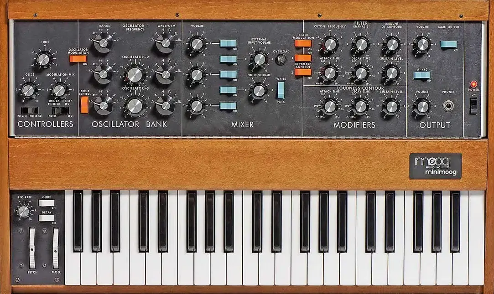
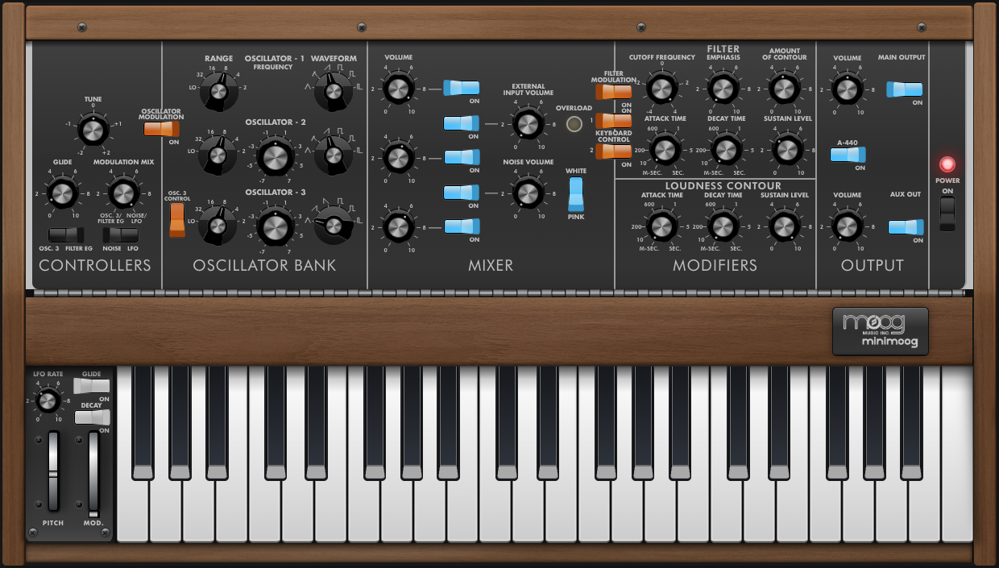

# Minimoog Model D Emulator

<p align="center">
  <br/>
  <em>Original Minimoog Model D (hardware)</em>
</p>

<p align="center">
  <br/>
  <em>Web-based Minimoog Model D Emulator (this project)</em>
</p>

A web-based emulation of the classic Minimoog Model D analog synthesizer, leveraging the Web Audio API for authentic sound synthesis and performance.

[](https://nodejs.org/)
[](https://reactjs.org/)
[](https://www.typescriptlang.org/)
[](https://vitest.dev/)
[](LICENSE)

---

## Table of Contents

- [Demo](#demo)
- [Overview](#overview)
- [Features](#features)
- [Quick Start](#quick-start)
- [Development](#development)
- [Project Structure](#project-structure)
- [Architecture](#architecture)
- [Testing](#testing)
- [URL State Persistence](#url-state-persistence)
- [Troubleshooting](#troubleshooting)
- [Contributing](#contributing)
- [Resources](#resources)
- [References](#references)
- [License](#license)

---

## Demo

Experience the Minimoog Model D emulator in your browser:

1. **Live Demo**: [https://minimoog.vercel.app](https://minimoog.vercel.app/)
2. **Local Development**: Follow the [Quick Start](#quick-start) guide below

---

## Overview

This project recreates the iconic Minimoog Model D synthesizer in the browser using modern web technologies. It provides an authentic recreation of the original instrument's sound and interface, making the legendary synthesizer accessible to anyone with a web browser.

- **Authentic Sound**: Faithful recreation of the synthesizer's oscillator characteristics and filter behavior
- **Real-time Performance**: Low-latency audio processing for live performance
- **Responsive Design**: Works seamlessly on desktop and mobile devices
- **Modern Web Standards**: Built with React 19, TypeScript, and Web Audio API
- **Open Source**: Complete source code available for learning and modification

---

## Features

### Core Synthesis

- **Three-Oscillator Architecture**: Classic waveforms (sawtooth, triangle, square, reverse sawtooth, pulse)
- **Authentic Mixer**: Individual volume controls for oscillators, noise, and external input
- **4-Pole Ladder Filter**: Authentic Minimoog ladder filter with resonance and key tracking using Web Audio API
- **Dual Envelope Generators**: Filter and loudness contours with authentic response curves

### Modulation & Control

- **Modulation Sources**: LFO, noise, oscillator 3, and filter envelope
- **MIDI Support**: Connect your MIDI keyboard for real-time control
- **Virtual Keyboard**: On-screen keyboard with mouse and touch support
- **Performance Controls**: Glide, pitch bend, and modulation wheel

### User Experience

- **Preset System**: Curated collection of classic Minimoog sounds
- **URL State Persistence**: Save and share your current settings via URL parameters
- **Responsive Design**: Works on desktop and mobile devices
- **Logarithmic Controls**: Natural-feeling frequency, filter, and volume controls
- **Tuner Integration**: Built-in A-440 tone generator
- **Signal Indicator**: Real time display of incoming signal
- **Aux Output**: Secondary audio output for external routing

---

## Quick Start

### Prerequisites

- **Node.js**: Version 18.0.0 or higher
- **npm** or **yarn**: Package manager
- **Web Browser**: Chrome, Firefox, Safari, Edge (any modern browser with Web Audio API support)

### Installation

```bash
# Clone the repository
git clone "https://github.com/stevebarakat/minimoog"
cd minimoog

# Install dependencies
npm install

# Start development server
npm run dev
```

The application will be available at `http://localhost:5173`

---

### Development Scripts

```bash
npm run dev          # Start development server with hot reload
npm run build        # Build for production
npm run preview      # Preview production build locally
npm run test         # Run tests with Vitest
npm run test:ui      # Run tests with interactive UI
npm run test:coverage # Run tests with coverage report
npm run lint         # Run ESLint for code quality
npm run lint:css     # Run Stylelint and auto-fix issues
npm run lint:css:check # Check CSS without fixing
npm run analyze:css  # Analyze CSS structure and organization
```

---

## Project Structure

```
src/
  components/               # React UI components organized by feature
    OscillatorBank/         # Three-oscillator bank with modulation
      audio/                # Audio processing modules
        baseOscillator.ts   # Base oscillator implementation
        oscillator1.ts      # Oscillator 1 specific logic
        oscillator2.ts      # Oscillator 2 specific logic
        oscillator3.ts      # Oscillator 3 specific logic
      components/           # Oscillator sub-components
        Oscillator1.tsx     # Oscillator 1 controls
        Oscillator2.tsx     # Oscillator 2 controls
        Oscillator3.tsx     # Oscillator 3 controls
        WaveformSelector.tsx # Waveform selection component
      hooks/                # Oscillator-specific hooks
        useOscillator1.ts   # Oscillator 1 hook
        useOscillator2.ts   # Oscillator 2 hook
        useOscillator3.ts   # Oscillator 3 hook
        useOscillatorBank.ts # Main oscillator bank hook
        useOscillatorModulation.ts # Modulation controls
      icons/                # Waveform icons
        waveformIcons.ts    # Icon definitions
        WaveformIcon.tsx    # Icon component
      oscillatorRegistry.ts # Oscillator registration system
    Mixer/                  # Audio mixer with individual controls
      __tests__/            # Integration tests
    Filter/                 # 4-pole ladder filter and envelope controls
      __tests__/            # Integration tests
      KeyboardControl.tsx   # Filter keyboard tracking
      ModulationSwitch.tsx  # Filter modulation controls
    Envelopes/              # Filter and loudness envelope controls
      __tests__/            # Integration tests
        FilterEnvelope.integration.test.tsx
        LoudnessEnvelope.integration.test.tsx
      constants.ts          # Envelope timing constants
      FilterEnvelope.tsx    # Filter envelope component
      LoudnessEnvelope.tsx  # Loudness envelope component
    Controllers/            # Modulation and performance controls
      __tests__/            # Integration tests
    Keyboard/               # Virtual keyboard with MIDI support
      __tests__/            # Behavior and integration tests
        Keyboard.behavior.test.tsx
        Keyboard.integration.test.tsx
      components/           # Key components
        BlackKey.tsx        # Black key component
        WhiteKey.tsx        # White key component
      hooks/                # MIDI handling hooks
        useKeyboardHandlers.ts # Keyboard event handlers
        useKeyboardState.ts # Keyboard state management
        useMidiInput.ts     # MIDI input handling
        useNoteTracking.ts  # Note tracking logic
        useOctaveShift.ts   # Octave shifting
        usePitchBend.ts     # Pitch bend handling
        useVelocity.ts      # Velocity sensitivity
      types.ts              # Keyboard type definitions
      utils/                # Keyboard utilities
        keyboardMapping.ts  # Key mapping utilities
    Knob/                   # Reusable knob component with linear/log scaling
      __tests__/            # Behavior and keyboard tests
        Knob.behavior.test.tsx
      components/           # Knob sub-components
        KnobLabels.tsx      # Knob label component
        KnobRing.tsx        # Knob ring component
        KnobTicks.tsx       # Knob tick marks
      hooks/                # Knob interaction hooks
        useKnob.ts          # Main knob hook
        useKnobInteraction.ts # Interaction handling
      images/               # Knob visual assets
        arrow-knob.svg      # Arrow knob design
        radial-knob.svg     # Radial knob design
      utils/                # Knob calculation utilities
        __tests__/          # Calculation tests
        attackDecayMapping.ts # Attack/decay mapping
        knobCalculations.ts # Knob calculation logic
    RockerSwitch/           # Authentic rocker switch component
      __tests__/            # Behavior tests
      hooks/                # Keyboard interaction hooks
        useRockerSwitch.ts  # Rocker switch hook
        useRockerSwitchKeyboard.ts # Keyboard handling
      images/               # Switch visual assets
        rocker-off.svg      # Off state
        rocker-on.svg       # On state
        rocker-middle.svg   # Middle state
        rocker-base.svg     # Base component
    PresetsDropdown/        # Preset selection with URL sharing
      __tests__/            # Behavior tests
      components/           # Preset components
        PresetItem.tsx      # Individual preset item
        PresetList.tsx      # Preset list component
        PresetSearch.tsx    # Preset search functionality
      hooks/                # Preset management hooks
        usePresets.ts       # Preset loading and management
        usePresetSearch.ts  # Preset search functionality
    Output/                 # Main output and headphone controls
      __tests__/            # Aux output tests
      hooks/                # Aux output hooks
        useAuxOutput.ts     # Aux output functionality
        useMainOutput.ts    # Main output functionality
      AuxOut.tsx            # Auxiliary output component
      MainOutput.tsx        # Main output component
    Minimoog/               # Main synthesizer container
      __tests__/            # Integration tests
        Minimoog.integration.test.tsx
      components/           # Minimoog sub-components
      hooks/                # Audio node and envelope hooks
        __tests__/          # Hook tests
        useAudio.ts         # Main audio hook
        useAudioContextManagement.ts # Context management
        useAudioNodes.ts    # Audio node creation
        useEnvelopeNodes.ts # Envelope node management
        useFilterNodes.ts   # Filter node management
        useLfoNodes.ts      # LFO node management
        useMixerNodes.ts    # Mixer node management
        useModulationNodes.ts # Modulation node management
        useNoiseNodes.ts    # Noise node management
        useOscillatorNodes.ts # Oscillator node management
        useOutputNodes.ts   # Output node management
        usePerformanceNodes.ts # Performance node management
        usePresetNodes.ts   # Preset node management
        useSynthState.ts    # Synth state management
      types/                # Synth type definitions
        synthTypes.ts       # Main synth types
      utils/                # Synth utilities
        synthUtils.ts       # Synth utility functions
    Tuner/                  # Built-in tuner for pitch calibration
      __tests__/            # Tuner tests
      hooks/                # Tuner functionality hooks
        useTuner.ts         # Tuner functionality
        useTunerAudio.ts    # Tuner audio generation
    OverloadIndicator/      # Visual signal clipping indicators
    ExternalInput/          # External audio input controls
      __tests__/            # External input tests
      hooks/                # External input hooks
        useExternalInput.ts # External input functionality
    ModulationWheel/        # Modulation wheel component
    PitchBender/            # Pitch bend controls
    Glide/                  # Glide/portamento controls
      GlideSwitch.tsx       # Glide on/off switch
    Noise/                  # Noise generator controls
      hooks/                # Noise generation hooks
        useNoise.ts         # Noise generation functionality
    Modifiers/              # Audio modification controls
      __tests__/            # Integration tests
      hooks/                # Audio processing hooks
        filter-sum-processor.js # Filter sum processor
    ModulationMix/          # Modulation mixing controls
    LfoRate/                # LFO rate controls
    LfoWaveformSwitch/      # LFO waveform selection
    DecaySwitch/            # Decay switch controls
    PowerButton/            # Power on/off controls
      __tests__/            # Power button tests
    VintageLED/             # Vintage-style LED indicators
    Title/                  # Component title displays
    Section/                # Section container components
    Row/                    # Row layout components
    Column/                 # Column layout components
    Line/                   # Line separator components
    Spacer/                 # Spacing components
    Hinge/                  # Hinge component for folding panels
      images/               # Hinge visual assets
        hinge.svg           # Hinge design
    Side/                   # Side panel components
      images/               # Side panel textures
        side-panel.png      # Side panel texture
    SidePanel/              # Side panel container
      components/           # Side panel sub-components
        SidePanelContent.tsx # Side panel content
        SidePanelHeader.tsx # Side panel header
        SidePanelSection.tsx # Side panel sections
        SidePanelToggle.tsx # Side panel toggle
        SidePanelWrapper.tsx # Side panel wrapper
    Panels/                 # Panel components (Front, Back, Mid, Side)
      components/           # Panel sub-components
        BackPanel.tsx       # Back panel component
        FrontPanel.tsx      # Front panel component
        MidPanel.tsx        # Mid panel component
        SidePanel.tsx       # Side panel component
      images/               # Panel textures and assets
        back-panel.png      # Back panel texture
        front-panel.png     # Front panel texture
        mid-panel.png       # Mid panel texture
        side-panel.png      # Side panel texture
    Screw/                  # Screw component for authentic details
    Container/              # Main container component
    Logo/                   # Minimoog logo component
    Tune/                   # Tuning controls
    Wheel/                  # Wheel component for various controls
    GitHubRibbon/           # GitHub corner ribbon
    CopySettings/           # Copy settings functionality
      __tests__/            # Copy settings tests
      hooks/                # Copy settings hooks
        useCopySettings.ts  # Copy settings functionality
    ErrorBoundary/          # Error boundary component
    Toast/                  # Toast notification system
      __tests__/            # Toast tests
      hooks/                # Toast hooks
        useToast.ts         # Toast functionality
      ToastProvider.tsx     # Toast provider component
    Dropdown/               # Dropdown component
      __tests__/            # Dropdown tests
      DropdownTrigger.tsx   # Dropdown trigger component
  hooks/                    # Custom React hooks
    useAudioContext.ts      # Web Audio API context management
    useMediaQuery.ts        # Media query hook
    useURLSync.ts           # URL state synchronization
    useWindowSize.ts        # Window size hook
    useLocalStorage.ts      # Local storage hook
  store/                    # State management
    actions/                # State update actions
      __tests__/            # Action tests
      synthActions.ts       # Synth state actions
    selectors.ts            # State selectors
    state/                  # Initial state configuration
      initialState.ts       # Initial state definition
    types/                  # TypeScript type definitions
      synth.ts              # Synth type definitions
    synthStore.ts           # Main store implementation
  utils/                    # Utility functions
    __tests__/              # Utility tests
      presetConversion.test.ts # Preset conversion tests
      urlState.test.ts      # URL state tests
    audioUtils.ts           # Audio utility functions
    cssUtils.tsx            # CSS utility components
    envelopeUtils.ts        # Envelope utility functions
    knobMappingUtils.ts     # Knob mapping utilities
    noteToFrequency.ts      # Musical note utilities
    presetConversion.ts     # Preset format conversion
    urlState.ts             # URL parameter handling
    generatePresetURLs.ts   # Preset URL generation utilities
    cssPerformance.ts       # CSS performance optimization utilities
    helpers.tsx             # React helper components
    index.ts                # Utility exports
  data/                     # Static data
    presets.ts              # Preset definitions
  styles/                   # Global CSS and design tokens
    fonts/                  # Custom font files
      futura-black.woff     # Futura Black font
      futura-bold.woff      # Futura Bold font
      futura-extra-black.woff # Futura Extra Black font
      futura-light.woff     # Futura Light font
      futura-medium.woff    # Futura Medium font
    fonts.css               # Font declarations
    global.css              # Global styles
    reset.css               # CSS reset
    tokens.css              # Design tokens
  test/                     # Test configuration
    setup.ts                # Vitest setup file
    testHelpers.tsx         # Test helper components
    index.ts                # Test utilities
  types/                    # TypeScript type definitions
    css-modules.d.ts        # CSS Modules declarations
    index.ts                # Global type definitions
  config/                   # Configuration files
    __tests__/              # Config tests
    constants.ts            # Application constants
    index.ts                # Config exports
  App.tsx                   # Main application component
  main.tsx                  # Application entry point
  vite-env.d.ts             # Vite environment types

public/                     # Static assets
  images/                   # UI reference images
    minimoog-logo.webp      # Minimoog logo
    Minimoog-new.webp       # New Minimoog image
    minimoog-real.png       # Real Minimoog image
    minimoog-screenshot.png # Screenshot of the emulator
    minimoog-real.webp      # Real Minimoog webp
    minimoog-signalflow.png # Signal flow diagram
    minimoog-full.png       # Full Minimoog reference
  moog-filters/             # Moog filter implementations
    moog-authentic-processor.js
    moog-zdf-processor.js
    moog-hybrid-processor.js
    README.md               # Filter documentation
  noise-processors/         # Noise generation processors
    white-noise-processor.js
    pink-noise-processor.js
    README.md               # Noise processor documentation
  audio-processors/         # System audio processors
    modulation-monitor-processor.js
    overload-meter-processor.js
    README.md               # Audio processor documentation

resources/                  # Documentation and reference materials
  docs/                     # Additional documentation
    aux-output.md           # Aux output feature documentation
    css-modules-best-practices.md # CSS Modules guidelines
    authentic-minimoog-filter-improvements.md # Filter implementation notes
  minimoog-description.txt  # Detailed synthesizer documentation
  minimoog-signalflow.png   # Signal flow diagram
  web-audio-performance.txt # Performance optimization notes
  minimoog-full.png         # Full synthesizer reference image
```

---

## URL State Persistence

The Minimoog emulator supports saving and sharing your current settings via URL parameters:

### Features

- **Save Settings**: Click the "Copy URL" button next to the preset dropdown
- **Share Settings**: Share URLs to let others load your exact configuration
- **Bookmark Configurations**: Bookmark URLs to quickly return to specific sounds
- **Auto-Load**: Settings automatically load when visiting URLs with parameters

### Supported Parameters

All synth parameters are encoded in the URL, including:

- **Oscillators**: Waveforms, frequencies, and ranges
- **Mixer**: Levels and noise settings
- **Filter**: Cutoff, emphasis, and envelope settings
- **Modulation**: LFO, modulation mix settings
- **Performance**: Glide, keyboard control settings
- **Output**: Main and aux output settings

---

## Contributing

Want to improve the Minimoog Model D emulator? Contributions are welcome!

### How to Contribute

1. **Fork the Repository**: Create your own fork of the project
2. **Create a Branch**: Make changes in a feature branch
3. **Follow Guidelines**: Adhere to coding standards and practices
4. **Test Changes**: Ensure all tests pass
5. **Submit PR**: Create a pull request with clear description

### Areas for Contribution

- **Filter Implementation**: Make improvements to the 4-pole ladder filter implementation
- **Audio Engine**: Enhance the audio engine to better match the sound of original Minimoog
- **Performance**: Optimize audio and rendering
- **Testing**: Improve test coverage and quality
- **Accessibility**: Improve accessibility features

---

## Resources

### Documentation

- **[Minimoog Description](resources/minimoog-description.txt)**: In-depth explanation of the synthesizer's architecture and controls
- **[Signal Flow Diagram](resources/minimoog-signalflow.png)**: Visual overview of the internal signal routing
- **[Web Audio Performance Notes](resources/web-audio-performance.txt)**: Best practices for Web Audio API optimization

### Development Guides

- **[Aux Output Documentation](docs/aux-output.md)**: Detailed guide to the aux output feature
- **[CSS Modules Best Practices](docs/css-modules-best-practices.md)**: Guidelines for CSS Modules usage

### External Resources

- **[Web Audio API Documentation](https://developer.mozilla.org/en-US/docs/Web/API/Web_Audio_API)**: Official MDN documentation
- **[React Documentation](https://react.dev/)**: Official React documentation
- **[TypeScript Handbook](https://www.typescriptlang.org/docs/)**: TypeScript language guide

---

## References

### Technical References

- [Web Audio API Performance and Debugging Notes](https://padenot.github.io/web-audio-perf/)
- [Minimoog Model D Manual](resources/minimoog-description.txt)
- [Web Audio API Documentation (MDN)](https://developer.mozilla.org/en-US/docs/Web/API/Web_Audio_API)

### Project Configuration

- [Project Preferences](dev-preferences.json): Development preferences and guidelines
- [Vite Configuration](vite.config.ts): Build and development configuration
- [TypeScript Configuration](tsconfig.json): TypeScript compiler settings

### Audio Synthesis

- [4-Pole Ladder Filter](https://en.wikipedia.org/wiki/Ladder_filter): Minimoog's iconic ladder filter implementation
- [Analog Synthesizer Architecture](https://en.wikipedia.org/wiki/Analog_synthesizer): Overview of analog synthesis
- [Web Audio API Worklets](https://developer.mozilla.org/en-US/docs/Web/API/AudioWorklet): Custom audio processing

---

## License

This project is licensed under the MIT License - see the [LICENSE](LICENSE) file for details.

### License Summary

The MIT License allows you to:

- Use the software for any purpose
- Modify the software
- Distribute the software
- Distribute modified versions
- Use it commercially

The only requirement is that the original license and copyright notice be included in all copies or substantial portions of the software.

---

_Built with ❤️ by S.Barakat_
