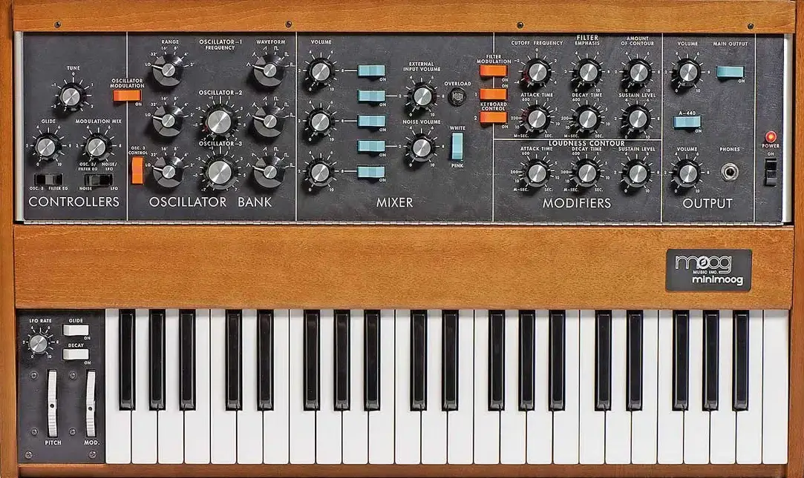
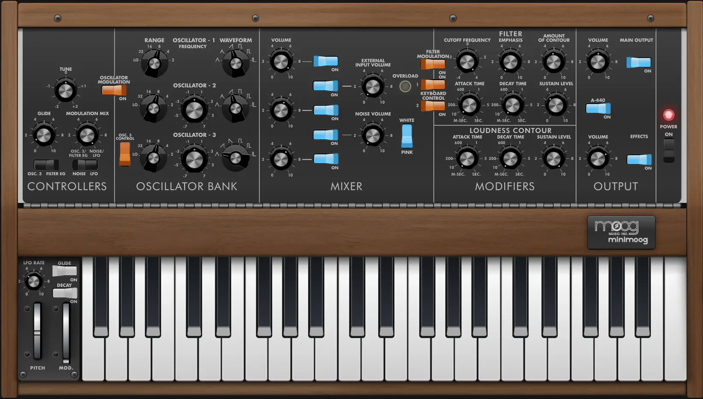

# Minimoog Model D Emulator

A web-based emulation of the classic Minimoog Model D analog synthesizer

[](https://nodejs.org/)
[](https://reactjs.org/)
[](https://www.typescriptlang.org/)
[](https://vitejs.dev/)
[](https://vitest.dev/)
[](LICENSE)

---

## Demo

Experience the Minimoog Model D emulator in your browser:

1. **Live Demo**: [minimoog.app](https://www.minimoog.app/)
2. **Install as App**: Click the install button in your browser to download as a native app

<p align="center">
  <br/>
  <em>Actual Minimoog Model D (hardware)</em>
</p>

<p align="center">
  <br/>
  <em>Web-based Minimoog Model D Emulator (this project)</em>
</p>

---

## Table of Contents

- [Overview](#overview)
- [Features](#features)
- [Quick Start](#quick-start)
- [Documentation](docs/README.md)
- [Contributing](#contributing)
- [Third-Party Credits](#third-party-credits)
- [References](#references)
- [License](#license)

---

## Overview

This project recreates the iconic Minimoog Model D synthesizer in the browser using modern web technologies. It provides an authentic recreation of the original instrument's sound and interface, making the legendary synthesizer accessible to anyone with a web browser.

- **Authentic Sound**: Faithful recreation of the synthesizer's oscillator characteristics and filter behavior
- **Real-time Performance**: Low-latency audio processing for live performance
- **MIDI Enabled**: Works out of the box with most MIDI keyboards (plug and play).
- **Progressive Web App**: Installable as a native app with full offline functionality

---

## Features

### Core Synthesis

- **Three-Oscillator Architecture**: Classic waveforms (sawtooth, triangle, square, reverse sawtooth, pulse)
- **Authentic Mixer**: Individual volume controls for oscillators, noise, and external input
- **4-Pole Ladder Filter**: Authentic Minimoog ladder filter using Huovilainen WASM implementation with resonance and key tracking
- **Dual Envelope Generators**: Filter and loudness contours with authentic response curves

### Modulation & Control

- **Modulation Sources**: LFO, Noise, Oscillator 3, and Filter Envelope
- **Performance Controls**: Glide, Pitch Bend, and Modulation Wheel
- **Virtual Keyboard**: On-screen keyboard with mouse and touch support
- **QWERTY Keyboard**: Use computer keyboard to for real-time control
- **MIDI Support**: Use MIDI keyboard for real-time control

### Effects & Processing

- **Digital Delay**: Variable delay time with feedback control for echo effects
- **Convolution Reverb**: High-quality reverb with tone filtering and adjustable mix

### User Experience

- **Interactive Onboarding**: 13 step guided tour for new users
- **Learning Mode**: Shows tooltips for each control describing what it does.
- **Preset System**: Curated collection of Minimoog sounds
- **URL State Persistence**: Save and share current settings via URL parameters
- **Knob Magnification**: Option to magnify knobs for more precision control

### Progressive Web App (PWA)

- **Installable**: Download as a native app on desktop and mobile devices
- **Offline Functionality**: Works completely offline once installed
- **Automatic Updates**: Service worker ensures you always have the latest version

---

## Quick Start

### Prerequisites

- **Node.js**: Version 18.0.0 or higher
- **npm** or **yarn**: Package manager
- **Web Browser**: Chrome, Firefox, Safari, Edge (any modern browser with Web Audio API support)

### Installation

```bash
# Clone the repository
git clone "https://github.com/stevebarakat/minimoog"
cd minimoog

# Install dependencies
npm install

# Start development server
npm run dev
```

The application will be available at `http://localhost:5173`

---

### Development Scripts

#### Development & Build

```bash
npm run dev           # Start development server with hot reload (includes --host)
npm run build         # Build for production
npm run preview       # Preview production build locally
```

#### Testing

```bash
npm run test          # Run tests with Vitest
npm run test:ui       # Run tests with interactive UI
npm run test:coverage # Run tests with coverage report
```

#### Code Quality & Linting

```bash
npm run lint          # Run ESLint for JavaScript/TypeScript code quality
npm run lint:css      # Run Stylelint for CSS and auto-fix issues
npm run lint:css:check # Check CSS without auto-fixing
npm run analyze:css   # Analyze CSS structure and organization
```

---

## Contributing

### How to Contribute

1. **Fork the Repository**: Create your own fork of the project
2. **Create a Branch**: Make changes in a feature branch
3. **Follow Guidelines**: Adhere to coding standards and practices
4. **Test Changes**: Ensure all tests pass
5. **Submit PR**: Create a pull request with clear description

### Areas for Contribution

- **Accessibility**: Improve UX for tabbed navigation and keyboard controls
- **Design**: Improve UI for smaller screens
- **Misc**: Any other ideas are welcome!

---

## Third-Party Credits

This project incorporates several third-party libraries, algorithms, and research contributions:

### 🎵 Audio Filter Algorithm

#### Huovilainen Filter Implementation

- **Research**: Based on work by Antti Huovilainen (2004, 2010)
- **Implementation**: Adapted from CSound5 implementation by Victor Lazzarini
- **License**: LGPLv3 (original CSound5 implementation)
- **Reference**: [Non-Linear Digital Implementation of the Moog Ladder Filter](https://dafx.de/paper-archive/2004/P_061.PDF)

### 🛠️ Core Libraries

#### State Management

- **[Zustand](https://github.com/pmndrs/zustand)** - Lightweight state management
- **License**: MIT

#### UI Components

- **[Radix UI](https://www.radix-ui.com/)** - Accessible UI primitives
  - `@radix-ui/react-toast` - Toast notifications
  - `@radix-ui/react-tooltip` - Tooltip components
  - `@radix-ui/react-dialog` - Modal component
- **[react-rnd](https://github.com/bokuweb/react-rnd)** - Resizable and draggable component
- **License**: MIT

#### Utilities

- **[clsx](https://github.com/lukeed/clsx)** - Conditional className utility
- **[loglevel](https://github.com/pimterry/loglevel)** - Lightweight logging
- **[Lucide React](https://lucide.dev/)** - Icon library
- **[Typed Storage](https://github.com/yeunoia/typed-storage)** - Type-safe localStorage wrapper
- **License**: MIT

#### Development Tools

- **[React](https://react.dev/)** - UI library
- **[TypeScript](https://www.typescriptlang.org/)** - Type safety
- **[Vite](https://vitejs.dev/)** - Build tool
- **[Vitest](https://vitest.dev/)** - Testing framework
- **License**: MIT

### 📄 License Compliance

All third-party code is used in compliance with their respective licenses:

- **MIT License**: Most libraries and utilities
- **LGPLv3**: Huovilainen filter implementation (CSound5 derived)

---

## References

### Web Audio API

- [Web Audio API Documentation (MDN)](https://developer.mozilla.org/en-US/docs/Web/API/Web_Audio_API)
- [Web Audio API Performance and Debugging Notes](https://padenot.github.io/web-audio-perf/)

### Minimoog Model D

- [Minimoog Model D Manual](https://api.moogmusic.com/sites/default/files/2022-11/Minimoog_Model_D_Manual.pdf)
- [Minimoog Signal Flow](resources/minimoog-signalflow.png)

---

## License

This project is licensed under the MIT License - see the [LICENSE](LICENSE) file for details.

### License Summary

The MIT License allows you to:

- Use the software for any purpose
- Modify the software
- Distribute the software
- Distribute modified versions
- Use it commercially

The only requirement is that the original license and copyright notice be included in all copies or substantial portions of the software.

---

_&copy; 2005 [Steve Barakat](https://stevebarakat.com)_
